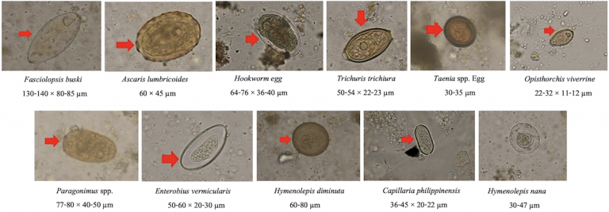
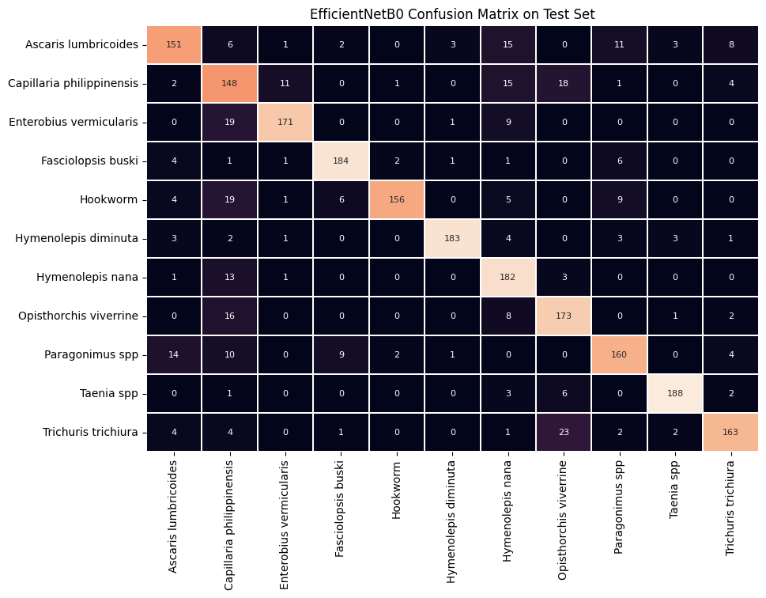

# **Intestinal Parasitic Egg Classification in Microscopic Images using CNNs**

MSDS692: Data Science Practicum I Project

Author: Lonny Cox-Lauf

## Purpose

Intestinal Parasitic Infections (IPIs) are one of the most common causes of illness in the world, and they can cause harsh symptoms and even death in some cases. These symptoms can include (but are not limited to): nausea, nutritional deficiency, abdominal pain, and more. IPIs typically manifest themselves in developing locations, such as sub-Saharan Africa, the Caribbean, and Asia. IPIs are historically classified by only visual analysis of microscopic images. Because of ambiguities in the parasitic eggs, such as with their colors, shapes, or densities, they can be misclassified and thus the IPI is misdiagnosed for the patient. The goals are to:
1. Minimize this risk for human error
2. Decrease the amount of waiting time before the classification is made by a doctor

Both of these goals will result in the patients getting placed on the proper medication in a timely manner.

Plus, historically, CNN architectures have proven to be an incredibly effective tool in the medical imaging field.	For example, CNNs have been used to detect malaria, tuberculosis, and many other conditions.

## How to Run the Project in Google Colab

1. Download Chula-ParasiteEgg-11.zip to your local machine (too large to add to this repository, but it will be submitted in WorldClass instead)
2. Copy or move the .zip file above somewhere in your personal Google Drive
3. Open Google Colab: https://colab.research.google.com/
4. In Colab, click File > 'Open Notebook'
5. In the pop-up window, select the GitHub tab, then copy and paste this GitHub repository high level link in the field box: https://github.com/LonnyCox55/MSDS692_ParasiticInfectionCNN/tree/main
6. You should now see my src/main.ipynb file that can be opened up, click that and the Python Jupyter Notebook file will open in Colab
7. Click Runtime > Change Runtime Type, then ensure that one of the GPU servers is being used (i.e., T4 GPU or A100 or V100)
8. Edit cell #5 (where the !unzip command occurs) to match where the .zip file was placed in your personal Google Drive
9. Runtime > Run all

## Dataset Description

The dataset contains 11 classes of parasitic eggs, with each class containing 1,000 images. This gives a total of 11,000 images. The images were taken as microscopic images from human faecal samples, all of which contain intestinal parasitic infectious (IPI) eggs in view. The quality of image varies greatly, as some images are more blurry than others, and some are more zoomed in on the egg while others are zoomed out. This all adds to the complexity of this image classifier project.

## Image Data Cleaning

The images had to be:

* Unzipped into Google drive
* Cropped using their corresponding bounding boxes (found in the labels.json file that accompanied the image dataset)
* Image files were broken out into subdirectories for each class (label) and training, validation, test splits

## Evaluation of Best Model Performance

EfficientNetB0 CNN architecture as the base for the model achieved a F1-score of 0.84714 when making class predictions on the test set. This strong F1-score indicates that *both* the precision *and* recall were favorable, as F1-score is the harmonic mean of precision and recall metrics. In other words, if either precision or recall was relatively low, the F1-score would be brought down much more than if the calculation was simply the statistical (standard) mean of precision and recall.

See below for a confusion matrix representing the correct prediction counts (on the main diagonal) and incorrect prediction counts (off the main diagonal):

## Conclusion

In summary, coming into this project, I knew that CNNs have been excellent tools regarding the medical imaging field, so I knew this would be an interesting experiment. I saw the best results and metrics with my model based on the EfficientNetB0 architecture. As mentioned on the last slide, there is plenty of room for improvement and other base CNN architectures to play around with to try increasing the accuracy. And finally, this was definitely a learning experience for me, as the image data cleaning, cropping, and organization took longer than initially expected. In the future, it would be interesting to use the scaled-up versions of EfficientNet and see how much the metrics such as F1 score improve. There is also a 2nd version of EfficientNet called EfficientNetV2, which I found listed in the Keras documentation, so it would be interesting to try that as well. It may also be beneficial to freeze less layers in EfficientNet and refine some more of the convolutional layers to try fitting the model better to my specific parasite egg data. Finally, activation maps would be beneficial to see the parts of the images that are deemed “most significant” to see how the model is making selections.

